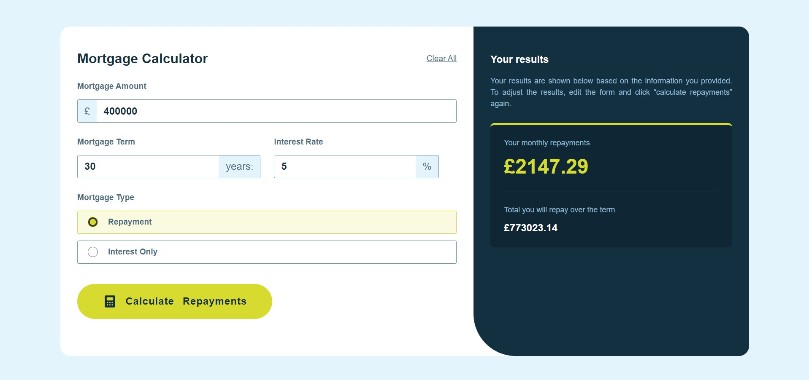

# Frontend Mentor - Mortgage repayment calculator solution

This is a solution to the [Mortgage repayment calculator challenge on Frontend Mentor](https://www.frontendmentor.io/challenges/mortgage-repayment-calculator-Galx1LXK73). Frontend Mentor challenges help me improve my coding skills by building realistic projects.

## Table of contents

- [Overview](#overview)
  - [The challenge](#the-challenge)
  - [Screenshot](#screenshot)
  - [Links](#links)
- [My process](#my-process)
  - [Built with](#built-with)
  - [What I learned](#what-i-learned)
  - [Continued development](#continued-development)
  - [Useful resource](#useful-resource)
- [Author](#author)


## Overview

### The challenge

Your users should be able to:

- Input mortgage information and see monthly repayment and total repayment amounts after submitting the form
- See form validation messages if any field is incomplete
- Complete the form only using their keyboard
- View the optimal layout for the interface depending on their device's screen size
- See hover and focus states for all interactive elements on the page

### Screenshot



### Links

- Solution URL: [Solution URL](https://github.com/Andrey1914/mortgage-repayment-calculator)
- Live Site URL: [Live site URL](https://mortgage-repayment-calculator-chi.vercel.app/)

## My process

### Built with

- Semantic HTML5 markup
- CSS custom properties
- Flexbox
- Mobile-first workflow
- [React](https://reactjs.org/) - JS library
- [Next.js](https://nextjs.org/) - React framework
- [Styled Components](https://styled-components.com/) - For styles

### What I learned

- I used nextjs for this project.
- I practiced writing a project using type-script.
- After writing the whole project, I refactored the code, divided it into smaller components.
- Using `styled components` library, the `themeProvider` applied.
- I wrote styles at an advanced level, i.e. css-in-js.

Here are some code examples:

```ts
import React from "react";
import { BtnClearAll } from "@/app/styles";
import { ClearAllButtonProps } from "@/interfaces";

const ClearAllButton: React.FC<ClearAllButtonProps> = ({ clearAllFields }) => (
  <BtnClearAll onClick={clearAllFields}>Clear All</BtnClearAll>
);

export default ClearAllButton;
```

```ts
const triggerWarningsInCaseOfEmptyFields = (): boolean => {
    let newWarnings: { [key: string]: boolean } = {};
    if (!mortgageAmount) newWarnings.mortgageAmount = true;
    if (!mortgageTerm) newWarnings.mortgageTerm = true;
    if (!interestRate) newWarnings.interestRate = true;
    if (!isRepayment && !isInterestOnly) newWarnings.repaymentType = true;
    setWarnings(newWarnings);
    return Object.keys(newWarnings).length === 0;
  };
```

```css
export const FinalResultText = styled.span`
  color: ${(props) => props.theme.colors.slate300};
  margin-bottom: ${(props) => props.theme.spaces[3]};
  display: block;
  font-size: large;
`;
```

### Continued development

I plan to use the aforementioned technologies and methods of writing code in future projects.

### Useful resource

- [Example resource](https://nextjs.org/docs/app/building-your-application/styling/css-in-js#styled-components) - This is a great article that helped me better understand the styled-components library. I would recommend it to anyone who is still learning this concept.

## Author

- Website - [Andrey](https://portfolio-andrei-kurka.netlify.app/)
- Frontend Mentor - [@Andrey1914](https://www.frontendmentor.io/profile/yourusername)
- LinkedIn - [Andrei Kurka](https://www.linkedin.com/in/andrei-kurka/)

